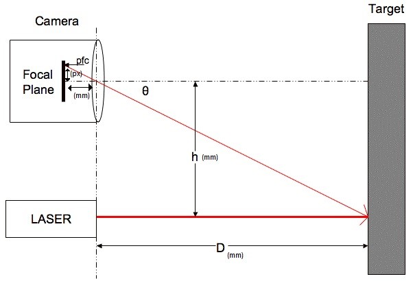

# EKF-SLAM
## Robot body and sensor
A cheap distance sensor made from a fixed line laser and camera module
  
Principle of operation:
  
Distance/speed/heading is calculated from wheel encoders and continuous servo motors that exist on the robot assembly shown below.

## Example with real world data
  
Top left is raw image from camera sensor where shape is extracted and possible lines are extracted from the environment. These lines, if corners can be extracted, form part of the landmarks.
The distance measurements are transformed for a birds-eye view of the robot, where the elipses around both the landmarks and robot show the certainty of position.
The black bread-trail shows corrected position of the robot in the environment where the grey bread-trail shows the uncorrected path.
The robot traverses in the environment and the EKF-SLAM algorithm is executed in real time.
## Example with fake generated data
  
Test environment with three landmarks showing how the certainty of the positions of the landmarks becomes higher since at each frame the robot sees the landmarks (with gaussian noise)

## Robot mapping
To map and simultaniously localize itself in an unknown environment the robot predicts with an extended kalman filter based on a movement model, where it is and updates its believed position from previous data and previously seen landmarks. 

